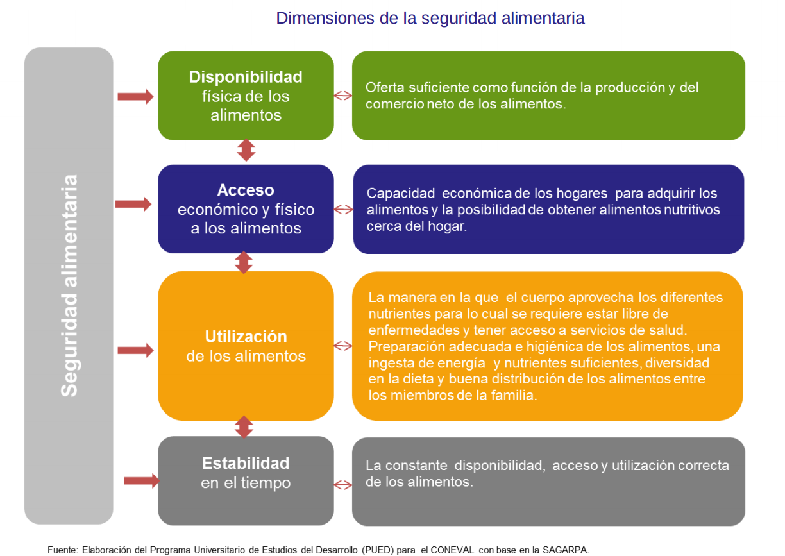
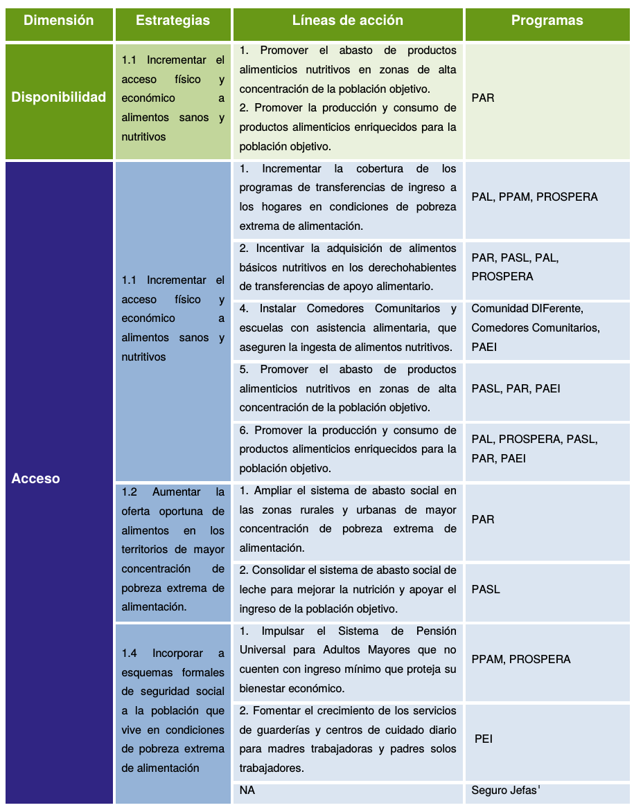
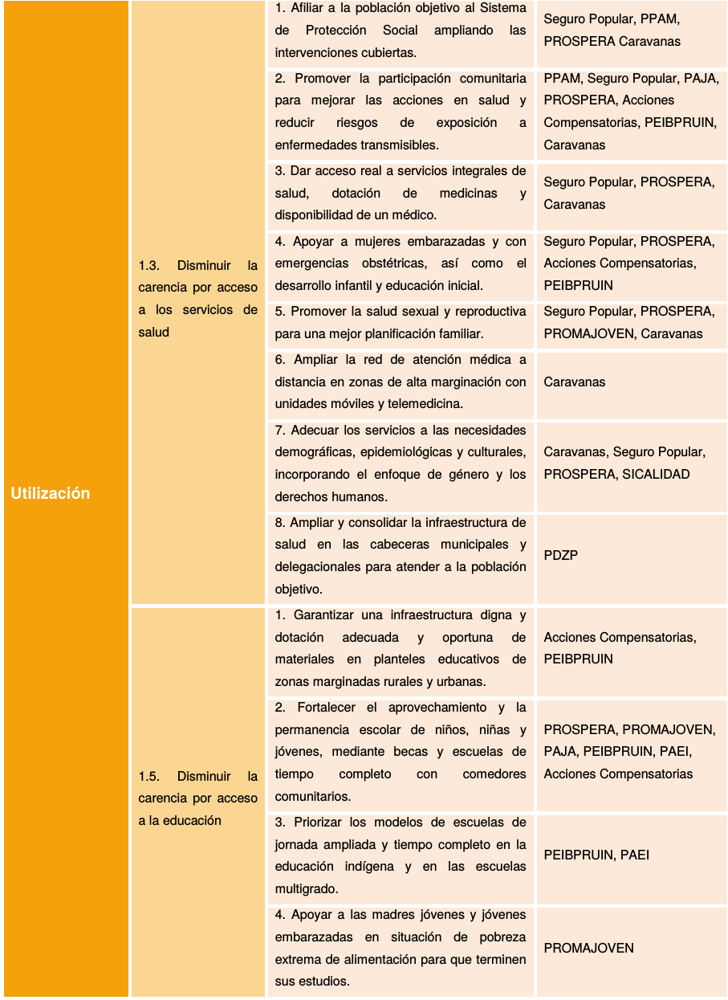
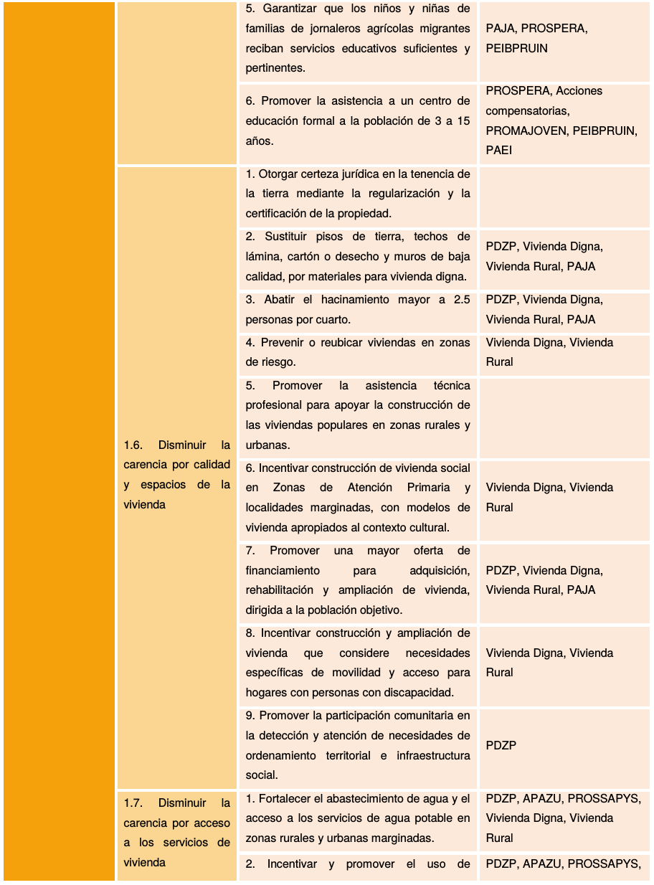
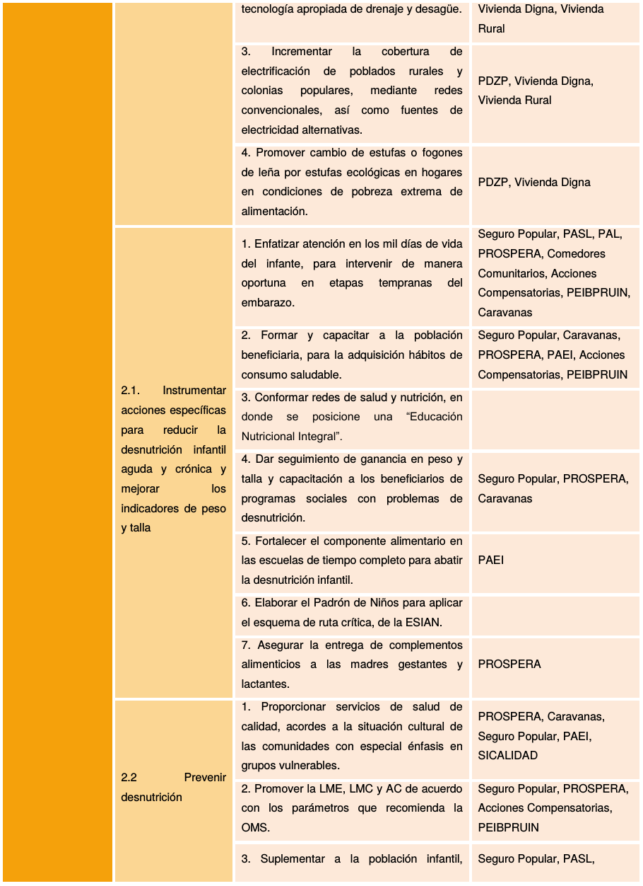
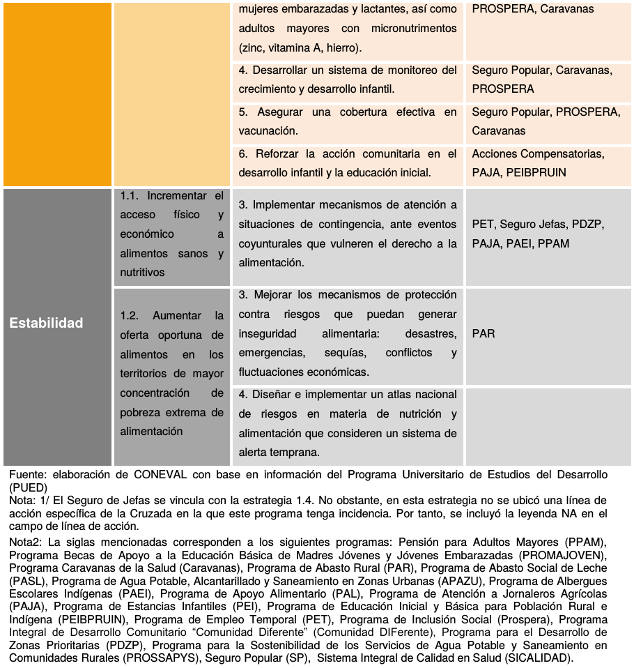

## Problemática del hambre y la desnutrición

Información tomada del documento: *Diagnóstico sobre alimentacion y nutrición.* Coneval. http://www.coneval.org.mx/Evaluacion/ECNCH/Documents/Diagnostico_sobre_alimentacion_y_nutricion_270715.pdf

La problemática del hambre y la desnutrición puede analizarse en el marco de la seguridad alimentaria desarrollada por la Organización de las Naciones Unidas para la Alimentación y la Agricultura (FAO). El concepto de seguridad alimentaria surge a mediados de la década de los setenta, derivado de la crisis mundial generada por el alza de los precios de los alimentos a nivel internacional, que ocasionó problemas de disponibilidad, principalmente de trigo y maíz. Incluso después de que se habían estabilizado los precios y la oferta, principalmente de cereales, fue evidente que la disponibilidad suficiente de alimentos no garantizaría la ingesta nutricional adecuada.

En la Cumbre Mundial de la Alimentación de 1996 se llevó a cabo una revisión al concepto de seguridad alimentaria y se acordó la siguiente definición: “existe seguridad alimentaria cuando todas las personas tienen en todo momento acceso físico y económico a suficientes alimentos inocuos y nutritivos para satisfacer sus necesidades alimenticias y sus preferencias en cuanto a los alimentos a fin de llevar una vida activa y sana” (FAO, 1996: 4). Así, se incorporó el acceso a los alimentos además de la disponibilidad de los mismos. Adicionalmente, el concepto incluyó la necesidad de una dieta sana, considerando los macronutrientes y los micronutrientes necesarios, y no sólo las calorías suficientes

### Dimensiones de la seguridad alimentaria

El concepto de Seguridad Alimentaria y Nutricional (SAN) se aborda a través de los cuatro pilares reconocidos por la FAO: la disponibilidad, la accesibilidad, la utilización y la estabilidad de la oferta. 
  

Donde disponibilidad física de los alimentos, la cual se refiere a una oferta suficiente y es una función de la producción y del comercio neto de los alimentos. En el segundo puesto está el acceso económico y físico a los alimentos que se refiere a la capacidad económica de los hogares para adquirir los alimentos y a la posibilidad de obtener alimentos nutritivos cerca del hogar. La utilización de los alimentos es la manera en la que el cuerpo aprovecha los diferentes nutrientes, para lo cual se requiere estar libre de enfermedades y tener acceso a servicios de salud. Esta dimensión incluye una preparación adecuada e higiénica de los alimentos, una ingesta de energía y nutrientes suficientes, diversidad en la dieta y buena distribución de los alimentos entre los miembros de la familia. Finalmente, la cuarta dimensión es la estabilidad en el tiempo de las tres dimensiones anteriores, es decir, la disponibilidad, el acceso y la utilización correcta de los alimentos debe ser constante. La dimensión de estabilidad está relacionada con la vulnerabilidad y con el concepto de inseguridad alimentaria que se puede definir como “la probabilidad de una disminución drástica del acceso a los alimentos o de los niveles de consumo, debido a riesgos ambientales o sociales, o a una reducida capacidad de respuesta” (FAO-PESA, s.f.)." 

##  Causas del Hambre

De forma directa, el hambre puede deberse a un limitado acceso económico a los alimentos lo cual, en muchos casos, está asociado a condiciones de pobreza y a la falta de empleo bien remunerado que genere suficientes ingresos para adquirirlos. Así también, habitar en comunidades marginadas puede limitar el acceso físico, debido a que los alimentos no están disponibles porque los mercados no funcionan adecuadamente y las vías de acceso son limitadas. Sin embargo, el hambre también podría deberse a una insuficiente disponibilidad de alimentos en el país.3 Para garantizar una oferta suficiente, es necesario promover la producción de alimentos (agrícolas, ganaderos, pesqueros) mediante políticas de apoyo a estos sectores y una adecuada inversión. Por último, existen diversas circunstancias que ponen en riesgo el acceso y la disponibilidad de alimentos. La inestabilidad de los mercados puede ser resultado de choques internos o externos como, por ejemplo, crisis económicas o el alza en los precios de los alimentos a nivel internacional. El cambio climático está desempeñando un papel importante dado que afecta la producción de alimentos y está asociado con la ocurrencia de un mayor número de fenómenos hidrometereológicos que pueden generar situaciones temporales de escasez de alimentos en ciertas localidades. Así también, las guerras y desplazamientos complican la producción, el abasto y el acceso a alimentos.
        
### Causas relacionadas con acceso físico a los alimentos

Una de las causas del hambre puede ser la falta de una oferta suficiente de alimentos en todas las localidades de un territorio nacional. Por esta razón, es necesario crear mecanismos de distribución eficiente y promover la existencia de mercados en todo el país. Para ello, se requiere, entre otras acciones, la construcción de vías de acceso adecuadas y bodegas para almacenar los alimentos. 

### Causas relacionadas con insuficiente acceso económico a los alimentos 

Esta dimensión de la seguridad alimentaria se refiere a la dificultad que enfrentan las personas para adquirir alimentos debido a la insuficiencia de recursos económicos y, por tanto, se asocia estrechamente con la pobreza. El gasto en alimentos es proporcionalmente mayor entre los hogares de menores ingresos.  La situación macroeconómica de los países es clave para que su población tenga la posibilidad de generar ingresos y para tener acceso a alimentos durante todo el año. Para la población de bajos recursos, la inestabilidad en los precios de los alimentos que se ha experimentado en los últimos años ha derivado en la dificultad para adquirir alimentos nutritivos de manera constante. Si bien este indicador está relacionado con la dimensión de estabilidad, dada su incidencia directa en el poder adquisitivo de la población que vive en pobreza, también lo está con el acceso económico. Así, el monitoreo de los precios de los alimentos cobra especial importancia, sobre todo considerando que influyen en gran medida en la inflación.

### Causas relacionadas con la utilización de los alimentos

La utilización se entiende como la forma en la que el cuerpo aprovecha los diversos nutrientes presentes en los alimentos. El ingerir energía y nutrientes suficientes es el resultado de buenas prácticas de salud y alimentación, la correcta preparación de los alimentos, la diversidad de la dieta y la buena distribución de los alimentos dentro de los hogares. Si se combinan esos factores con el buen uso biológico de los alimentos consumidos, se obtiene la condición nutricional de los individuos (FAO, 2011), mientras la falta de los mismos puede ocasionar problemas relacionados con la desnutrición y el hambre. Por ello, las causas del hambre y de la desnutrición infantil relacionadas con esta dimensión de la seguridad alimentaria, incluyen enfermedades, así como diversos factores que pueden provocarlas. La utilización de los alimentos también está influenciada por la forma en que éstos se manipulan, elaboran y almacenan. Una buena salud es indispensable para que el cuerpo humano absorba los nutrientes de forma efectiva, y la higiene de los alimentos ayuda a mantener un cuerpo sano. El acceso a agua limpia es fundamental para la preparación de alimentos limpios y saludables (FAO, 2011). Además, diversos estudios refieren el impacto que tiene la calidad de la vivienda en la salud de sus habitantes, Cattaneo et al. (2009)9 analizan la importancia de pisos firmes en la salud de los niños menores de seis años. Los resultados muestran que en hogares con piso de cemento los índices en enfermedades como la diarrea, anemia e infecciones por parásitos que afectan la salud de los niños son menores en comparación con aquellos que tienen piso de tierra.

La utilización de los alimentos responde al carácter de la malnutrición y los indicadores antropométricos asociados a esta, que recogen no solo los efectos de la inseguridad alimentaria, sino también los de una mala salud y enfermedades como la diarrea, la malaria, el VIH/SIDA y la tuberculosis (FAO, FIDA y PMA, 2013). La prevalencia de Enfermedades Diarreicas Agudas (EDA) en las zonas rurales a consecuencia de la ausencia de condiciones sanitarias básicas es un factor que aumenta a su vez el riesgo de sufrir desnutrición crónica (FAO, 2014b). En 2012, la prevalencia de EDA entre menores de cinco años fue de 11 por ciento, mientras la prevalencia de IRA fue de 44.8 por ciento.

Otro factor que debe considerarse es la desnutrición en las mujeres debido a que aumenta el riesgo de que sus hijos presenten bajo peso al nacer (Victoria et. al., 2008) y se presentan mayores dificultades para la producción de leche. Por tanto, se genera un círculo vicioso en el cual el estado nutricional deficiente de la madre afecta su capacidad para alimentar a sus hijos y trae efectos negativos en su salud.

## Buenas Prácticas Internacionales:

Con el fin de reducir la problemática del hambre y la desnutrición particularmente entre la población que vive en condición de pobreza, y principalmente a través de la incidencia en las dimensiones de acceso y utilización de los alimentos, organismos públicos, agencias internacionales y asociaciones civiles han ejecutado programas internacionales. Algunos de los más sobresalientes se revisan en esta sección con el propósito de exponer de forma breve algunas experiencias de intervenciones alimentarias que pueden servir de referente para informar las decisiones en torno a las estrategias y acciones que se han puesto en práctica para alcanzar los objetivos uno y dos de la Cruzada. No se incluye un reporte exhaustivo y concluyente sobre los modelos de intervención instrumentados en el ámbito internacional para combatir el hambre y mejorar la nutrición de la población en situación de pobreza. Se privilegiaron las experiencias que cuentan con evidencia de sus efectos sobre la problemática a partir de evaluaciones de impacto con metodologías rigurosas. Asimismo, se hicieron búsquedas en portales electrónicos de gobiernos nacionales que ejecutan programas sociales vinculados con el tema alimentario. Se considera que esta información permite identificar algunas buenas prácticas en la materia.

### Programas de transferencias monetarias condicionadas y no condicionadas

Los programas de transferencias monetarias condicionadas, que por lo general entregan transferencias monetarias directas mediante condicionalidades centradas en la asistencia a la escuela y a los controles de salud, buscan desarrollar el capital humano de las familias pobres. Según Rawlings y Rubio (2003), el componente educativo consiste en incentivar la inscripción, asistencia y conclusión de la educación básica mediante el otorgamiento de becas escolares y el de salud se enfoca en otorgar revisiones médicas y nutricionales, promover hábitos de higiene, favorecer el consumo de alimentos y dar orientación nutricional y suplementación para niños y mujeres en edad reproductiva o en lactancia. Al condicionar la entrega de transferencias, se generan incentivos para modificar favorablemente el comportamiento de los miembros de los hogares en educación, salud y alimentación. Asimismo, los recursos que se entregan sirven para mejorar el consumo alimentario. Este tipo de intervenciones surgieron durante la segunda mitad de la década de 1990 en Brasil y México y se han replicado en numerosos países a nivel internacional. Según el Banco Mundial, en 2008 existían veintiocho programas de transferencias monetarias condicionadas en el mundo: diecisiete en América Latina y el Caribe, tres en África y el resto en Asia (Banco Mundial, 2009a).11 Es importante destacar que si bien estos programas tienen rasgos comunes, cada uno tiene sus particularidades. Las evaluaciones de impacto muestran que los programas de transferencias monetarias condicionadas tienen impactos positivos en la salud, alimentación y nutrición. Por ejemplo, incrementan las tasas de crecimiento infantil, reducen los índices de desnutrición y propician la utilización de los servicios preventivos de salud (Rawlings y Rubio, 2003). Asimismo, incrementan el consumo de alimentos y contribuyen a que las familias gasten más dinero en comida y en mejores fuentes nutricionales (Banco Mundial, 2009b; WHO, 2013). También son efectivos en incrementar la matrícula y la asistencia escolar, así como para reducir la participación de los niños en actividades laborales (Schultz, 2001; Adato, 2004; Villatoro, 2004). Un distintivo de estos programas es que seleccionan a los beneficiarios mediante un proceso riguroso de focalización, disponen de sistemas de información que favorecen el monitoreo y el seguimiento de sus acciones y muchos de ellos se han sometido a evaluaciones de impacto rigurosas (Banco Mundial, 2009a).

### Ibnat-Belessa Integrated Food Security Programme, Etiopía

El Ibnat-Belessa Integrated Food Security Programme (IFSP) se implementó en la zona noroeste de Etiopía de 1997 a 2006 para promover la autosuficiencia alimentaria de las familias rurales. Mediante este programa se otorgaban alimentos básicos a los integrantes de las familias que, al verse afectados por las malas cosechas, factores ambientales o económicos, no disponían de alimentos durante algún periodo del año. Como parte de esta iniciativa, también se realizaron acciones para rehabilitar la infraestructura de las comunidades (caminos y carreteras), se promovió la producción agrícola y ganadera, y se abasteció a las localidades con agua para el riego de los cultivos (Abebaw, Fentie y Kassa, 2010). Abebaw, Fentie y Kassa (2010), evaluaron los efectos de este modelo haciendo comparaciones entre beneficiarios y no beneficiarios para identificar sus efectos. Como parte de este trabajo, llevaron a cabo encuestas para recabar información sobre el consumo de alimentos en el hogar, el acceso a los mercados, los productos agrícolas disponibles y las características demográficas de cada grupo analizado. Entre los resultados de la evaluación destaca que hubo un efecto positivo y estadísticamente significativo en el consumo de alimentos. En el grupo de beneficiarios del programa se observó un incremento en la ingesta calórica de 694 calorías más al día gracias a los apoyos del programa. Este incremento se registró particularmente en las familias que estaban encabezadas por mujeres, en las que tenían pocos integrantes y en las que tenían propiedad sobre las tierras (Abebaw, Fentie y Kassa, 2010: 5). El equipo evaluador identificó tres características del programa que repercutieron en el logro de los resultados: el monitoreo en campo realizado por un equipo multidisciplinario y con experiencia en los temas de alimentación y agricultura; la integralidad, es decir, que el programa disponía de diferentes componentes y los beneficiarios tenían la opción de elegir aquellos que satisfacían mejor sus necesidades; y, finalmente, que el programa tuvo cambios y adaptaciones acordes a las lecciones aprendidas de intervenciones ejecutadas previamente (Abebaw, Fentie y Kassa, 2010)

### Programa educativo de alimentación complementaria, China

En 2006, en la zona rural del noroeste de China, se implementó un modelo de intervención educativa para mejorar las prácticas de alimentación y la nutrición infantil. En algunas zonas rurales de ese país, los niños ingerían cantidades mínimas de verduras, aceite, lácteos y alimentos ricos en proteína debido a la creencia de que esos productos eran de difícil digestión y, por tanto, las madres y los padres no los suministraban a sus hijos, circunstancia que provocaba desnutrición (Shi et al., 2010: 556).  

La instrumentación de este modelo educativo implicó la capacitación de los profesionales de la salud que trabajaban en la región para que estuvieran en condiciones de realizar sesiones educativas sobre nutrición y transfirieran técnicas para la preparación de alimentos. Se llevaron a cabo visitas domiciliarias para identificar problemas de alimentación y proporcionar asesorías familiares y se entregaron folletos con información y orientación sobre alimentación y recetas de cocina, las cuales armonizaban con las tradiciones gastronómicas de la región, al tiempo que buscaban promover el consumo de verduras y de productos de alto valor proteínico (Shi et al. 2010: 557). Con el propósito de identificar los cambios en las prácticas de alimentación, conocer la frecuencia y la variedad de las comidas, y valorar las medidas de higiene durante la preparación de alimentos, el programa se evaluó con un grupo de intervención y otro de control. Como resultado, se encontró que en el primer grupo se habían mejorado las prácticas para diversificar los alimentos: los niños de seis a doce meses ya consumían vegetales de hoja verde, frutas, legumbres, aceites de cocina y carnes, situación que no se presentó con el grupo de control. Con relación a la higiene, las madres incorporaron el hábito de lavarse las manos con agua y jabón antes de cocinar o comer. Durante el estudio, los niños del grupo de intervención incrementaron 0.22 kg. en promedio y 0.66 centímetros más de altura en comparación con los niños que eran parte del grupo de control (Shi et al., 2010: 558-559).

### Recomendación de programas

El análisis específico del grado de vinculación de cada programa se llevó a cabo mediante la comparación de su objetivo central o propósito, sus objetivos específicos y sus tipos de apoyo, con cada una de las estrategias y líneas de acción de los objetivos uno y dos de la Cruzada, según lo establecido en el PNMSH. Se identificaron programas con vinculación directa, indirecta fuerte, indirecta débil e inexistente. 

### Bibliografía 

Abebaw D., Y. Fentie y B. Kassa (2010). The impact of a food security program on household food consumption in Northwestern Ethiopia: A matching estimator approach. Food Policy 35 (4): 286-293. 

Adato, M. (2004). “Programas de transferencias monetarias condicionadas: beneficios y costos sociales”, en J.Boltvinik y A.Damián (comp.), La pobreza en México y el mundo. México, Siglo XXI. 

Black, R.E. et al. 2013. Maternal and Child Nutrition Study Group. Maternal and child undernutrition and overweight in low-income and middle-income countries, Lancet. 

Banco Mundial (2009a). Conditional Cash Transfer Report (2009): CCT programs now in every continent. Recuperado el 29 de mayo de 2014 en http://econ.worldbank.org/WBSITE/EXTERNAL/EXTDEC/EXTRESEARCH/0,contentMDK:23091741~menuPK:574960~pagePK:64165401~piPK:64165 026~theSitePK:469382~isCURL:Y~isCURL:Y~isCURL:Y,00.html. 

______(2009b). Conditional Cash Transfer Report: Impacts of CCT programs. Recuperado el 29 de mayo de 2014 en http://econ.worldbank.org/WBSITE/EXTERNAL/EXTDEC/EXTRESEARCH/0 ,contentMDK:23091781~menuPK:574960~pagePK:64165401~piPK:64165026~theSitePK:469382~isCURL:Y~isCURL:Y~isCURL:Y,00.html. 

Cecchini, S. y A. Madariaga (2011). Programas de transferencias condicionadas Comisión Económica para América Latina y el Caribe (CEPAL). Santiago de Chile, División de Desarrollo Social. 

Cohen, E. y R. Franco (2006). Transferencias con corresponsabilidad. Una mirada Latinoamericana. SEDESOL, México.

Consejo Nacional de Evaluación de la Política de Desarrollo Social (CONEVAL) (2013a). Diagnóstico del Diseño de la Cruzada Nacional contra el Hambre. Octubre 2013. México. Recuperado el 15 de abril de 2014 de: http://www.coneval.gob.mx/Informes/Evaluacion/Cruzada%20contra%20el%20Hambre/DIAGNOSTICO_DISE%C3%91O_CNCH_OCTUBRE_2013.pdf 

_____ (2013b). Informe de la Evaluación Específica de Desempeño 2012-2013 del Programa de Abasto Social de Leche a cargo de Liconsa, S. A. de C. V. México, CONEVAL. Recuperado el 15 abril de 2014 de http://www.coneval.gob.mx/Informes/Evaluacion/Especificas_Desempeno2012/SEDESOL/20_S052/20_S052_Completo.pdf

_____ (2013c). Informe de la Evaluación Específica de Desempeño 2012-2013 del Programa de Apoyo Alimentario. México, CONEVAL. Recuperado el 15 abril de 2014 de http://www.coneval.gob.mx/Informes/Evaluacion/Especificas_Desempeno2012/SEDESOL/20_S118/20_S118_Completo.pdf 

_____ (2013d). Informe de la Evaluación Específica de Desempeño 2012-2013 del Programa de Desarrollo Humano Oportunidades. México, CONEVAL. Recuperado el 15 abril de 2014 de http://www.coneval.gob.mx/Informes/Evaluacion/Especificas_Desempeno2012/IMSS-%20OPORTUNIDADES/IMSS-OPORTUNIDADES_Completo.pdf 

(2013e). Informe de la Evaluación Específica de Desempeño 2012-2013 del Programa 70 y más / Pensión para Adultos Mayores. México, CONEVAL.